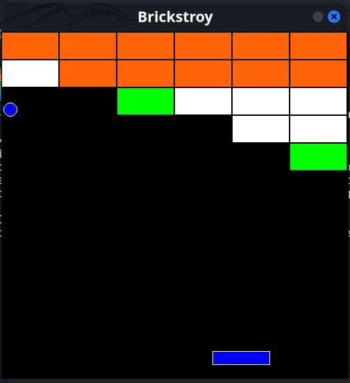

 
<div>

# 🧱 Brickstroy  
### 🎮 A Classic Brick Breaker Game Made with Pygame  


</div>

---

## 📖 About the Project

**Brickstroy** is a fun and interactive **Brick Breaker** game built using **Pygame**.  
The goal is simple — **break all the bricks** using your bouncing ball while controlling the paddle at the bottom.  
If the ball touches the bottom of the screen, the game is over!

This project is a great example of **game development fundamentals** in Python — including collision detection, object-oriented programming, and real-time rendering.

---

## 🕹️ Features

✅ Classic brick-breaking gameplay  
✅ 3 levels of brick strength (different colors for durability)  
✅ Responsive paddle control using arrow keys  
✅ Smooth ball physics and collision detection  
✅ "You Win" and "Game Over" messages  
✅ Simple and clean UI with score tracking logic

---

## 🧩 Gameplay Preview

 
|  |  

*(You can add screenshots by placing them inside the `/assets` folder.)*

---

## 🧠 Game Logic Overview

- **Blocks (Bricks):**  
  Created in rows and columns, each with varying strength.
  - Orange → 3 hits  
  - White → 2 hits  
  - Green → 1 hit

- **Ball:**  
  Moves continuously, bouncing off walls, bricks, and the paddle.  
  Loses the game if it touches the bottom edge.

- **Base (Paddle):**  
  Controlled using:
  - ⬅️ `Left Arrow` — Move Left  
  - ➡️ `Right Arrow` — Move Right  

---

## ⚙️ Installation and Setup

### 1️⃣ Clone the Repository
```bash
git clone https://github.com/hackerbytez/Brick_Game.git
cd Brick_Game
````

### 2️⃣ Install Dependencies

Make sure Python and Pygame are installed:

```bash
pip install pygame
```

### 3️⃣ Run the Game

```bash
python brick_game.py
```

---

## 🧱 Controls

| Action               | Key             |
| :------------------- | :-------------- |
| Move Left            | ⬅️ Left Arrow   |
| Move Right           | ➡️ Right Arrow  |
| Start / Restart Game | 🖱️ Mouse Click |

---

## 🧩 Code Structure

```
Brick_Game/
├── brick_game.py          # Main game logic file
├── README.md              # Project documentation
├── assets/                # (Optional) Images or screenshots
└── requirements.txt       # Dependencies file
```

---

## 🚀 Future Enhancements

* Add scoring system
* Add sound effects and background music
* Add multiple levels
* Implement lives and power-ups
* Add pause/resume feature

---

## 🧑‍💻 Author

**👨‍💻 Uday Raut**
🔗 [GitHub – Hacker Bytez](https://github.com/hackerbytez)
🌐 [hackerbytez.com](https://hackerbytez.com)

---

## 🪪 License

This project is licensed under the **MIT License** – see the [LICENSE](LICENSE) file for details.

---

<div align="center">

⭐ **If you like this project, don’t forget to star the repo!** ⭐

</div>
```
 
